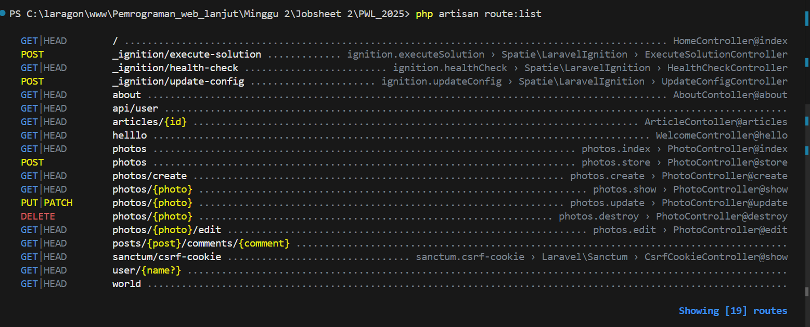
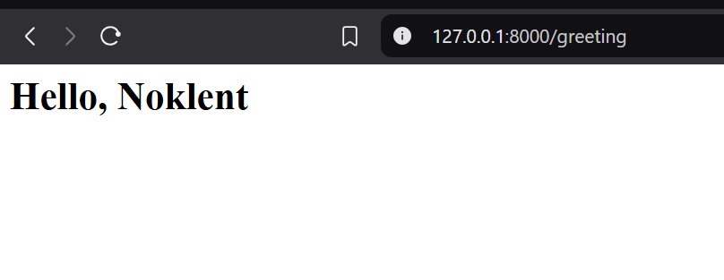
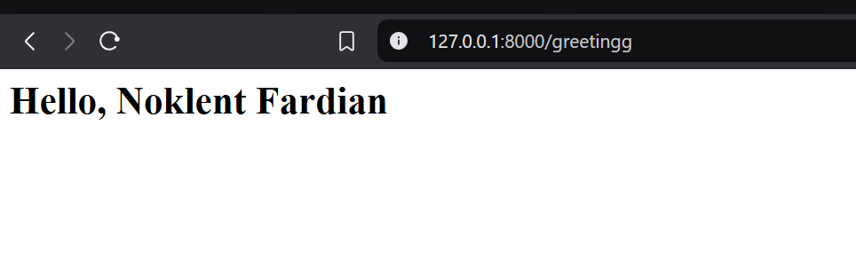
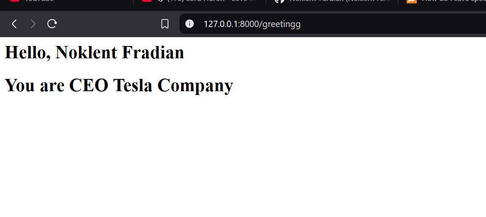
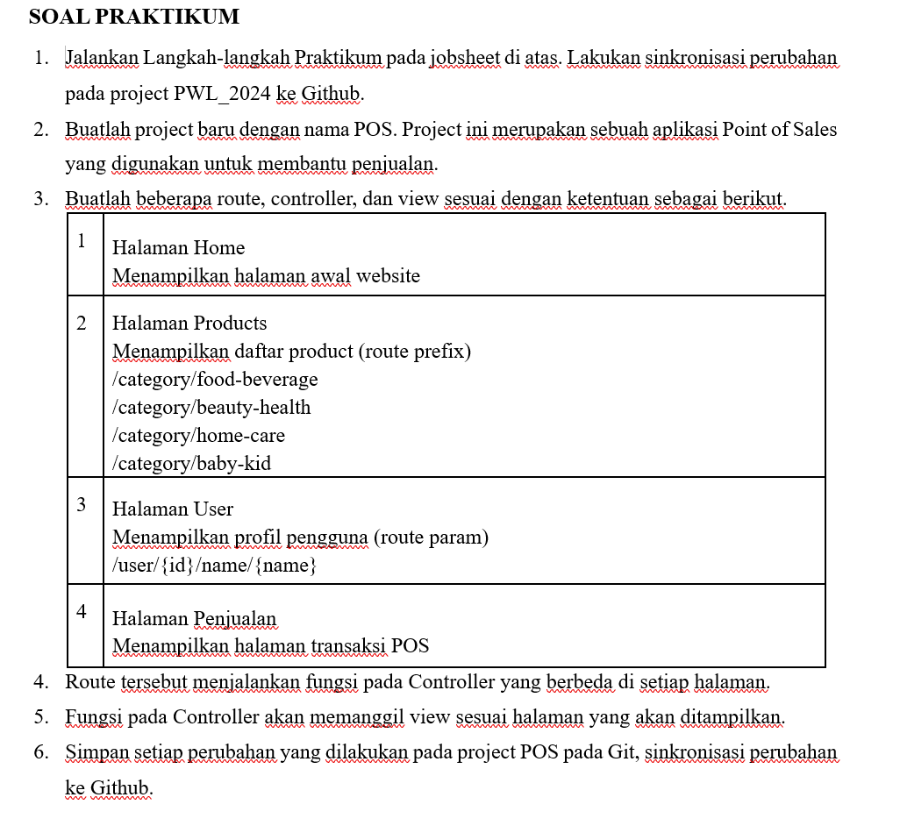
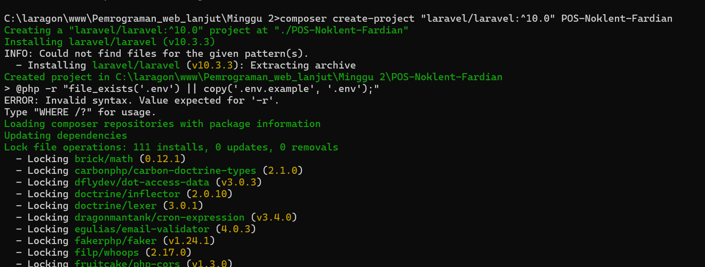

> Laporan Pemrogaman WEB Lanjut

Jobsheet 2

{width="4.229166666666667in"
height="3.1708333333333334in"}

Politeknik Negeri Malang

Semester 4

2025

> **NIM**\
> 2341720082
>
> **Nama**\
> Noklent Fardian Erix
>
> **Kelas**\
> 2A
>
> **Jurusan**\
> Teknologi Informasi
>
> **Progam Studi**\
> D-IV Teknik Informatika

+-----------------------------------+-----------------------------------+
| > **Laporan Pemrogaman WEB Lanjut | {width="1.2680544619422571in" |
|                                   | height="0.95in"}                  |
+===================================+===================================+
+-----------------------------------+-----------------------------------+

+-----------------------------------+-----------------------------------+
| > **Laporan Pemrogaman WEB Lanjut | {width="1.2680544619422571in" |
|                                   | height="0.95in"}                  |
+===================================+===================================+
+-----------------------------------+-----------------------------------+

> **1.Langkah Langkah Praktikum**
>
> **1.1Basic Routing**
>
> 1.Q: Buka file routes/web.php. Tambahkan sebuah route untuk nomor 1
> seperti di bawah ini:\
> A:

+-----------------------------------------------------------------------+
| > Route::get(\'/hello\', function () {                                |
+=======================================================================+
+-----------------------------------------------------------------------+

+-----------------------------------------------------------------------+
| > return\'Hello World\';                                              |
+=======================================================================+
+-----------------------------------------------------------------------+

+-----------------------------------------------------------------------+
| > });                                                                 |
+=======================================================================+
+-----------------------------------------------------------------------+

> 2.Q: Buka browser, tuliskan URL untuk memanggil route tersebut:\
> localhost/PWL_2024/public/hello. Perhatikan halaman yang muncul apakah
> sudah sesuai dan jelaskan pengamatan Anda.
>
> A:

+-----------------------------------------------------------------------+
| +------------------------------------------------------------------+  |
| | > Halaman web akan menampilkan hello world karena address hello  |  |
| | > mempunyai fungsi yang mereturn hello world                     |  |
| +------------------------------------------------------------------+  |
|                                                                       |
| > {width="6.268054461942257in" |
| > height="1.7902766841644795in"}                                      |
+=======================================================================+
+-----------------------------------------------------------------------+

> 3.Q: Bukalah pada browser, tuliskan URL untuk memanggil route
> tersebut:\
> localhost/PWL_2024/public/world. Perhatikan halaman yang muncul apakah
> sudah sesuai dan jelaskan pengamatan Anda.
>
> A:

+-----------------------------------------------------------------------+
| +------------------------------------------------------------------+  |
| | > Sama seperti pada nomor 2, namun returnya kali ini adalah      |  |
| | > world dalam bentu String                                       |  |
| +------------------------------------------------------------------+  |
|                                                                       |
| > {width="6.268054461942257in" |
| > height="1.547221128608924in"}                                       |
+=======================================================================+
+-----------------------------------------------------------------------+

> 2 **Laporan Pemrogaman WEB Lanjut-Jobsheet 2**

+-----------------------------------+-----------------------------------+
| > **Laporan Pemrogaman WEB Lanjut | {width="1.2680544619422571in" |
|                                   | height="0.95in"}                  |
+===================================+===================================+
+-----------------------------------+-----------------------------------+

> 4.Q: Selanjutnya, cobalah membuat route '/' yang menampilkan pesan
> 'Selamat Datang'. A:

+-----------------------------------------------------------------------+
| +------------------------------------------------------------------+  |
| | +-------------------------------------------------------------+  |  |
| | | > Route::get(\'/welcome\', function () {                    |  |  |
| | +=============================================================+  |  |
| | +-------------------------------------------------------------+  |  |
| |                                                                  |  |
| | +-------------------------------------------------------------+  |  |
| | | > return\'Selamat Datang Noklent\';                         |  |  |
| | +=============================================================+  |  |
| | +-------------------------------------------------------------+  |  |
| |                                                                  |  |
| | > });                                                            |  |
| +==================================================================+  |
| |                                                                  |  |
| +------------------------------------------------------------------+  |
|                                                                       |
| > {width="6.268054461942257in" |
| > height="1.2069444444444444in"}                                      |
+=======================================================================+
+-----------------------------------------------------------------------+

> 5.Q: Kemudian buatlah route '/about' yang akan menampilkan NIM dan
> nama Anda. A:

+-----------------------------------+-----------------------------------+
| **1.2**                           | +------------------------------+  |
|                                   | | +-------------------------+  |  |
|                                   | | | >                       |  |  |
|                                   | | |  Route::get(\'/about\', |  |  |
|                                   | | | > function () {         |  |  |
|                                   | | +=========================+  |  |
|                                   | | +-------------------------+  |  |
|                                   | |                              |  |
|                                   | | +-------------------------+  |  |
|                                   | | | > return\'NIM :         |  |  |
|                                   | | | > 2341720082 , Nama :   |  |  |
|                                   | | | > Noklent Fardian\';    |  |  |
|                                   | | +=========================+  |  |
|                                   | | +-------------------------+  |  |
|                                   | |                              |  |
|                                   | | > });                        |  |
|                                   | +==============================+  |
|                                   | |                              |  |
|                                   | +------------------------------+  |
|                                   |                                   |
|                                   | > {width="6.268054461942257in" |
|                                   | > height="1.2472222222222222in"}  |
|                                   | >                                 |
|                                   | > **Route Paramater**             |
+===================================+===================================+
+-----------------------------------+-----------------------------------+

> 1.Q: Jalankan kode dengan menuliskan URL untuk memanggil route
> tersebut: localhost/PWL_2024/public/user/NamaAnda. Perhatikan halaman
> yang muncul dan jelaskan pengamatan Anda.
>
> A:

+-----------------------------------------------------------------------+
| +------------------------------------------------------------------+  |
| | > Halaman akan memunculkan nama yang sama dengan address         |  |
| +------------------------------------------------------------------+  |
|                                                                       |
| > {width="6.268054461942257in" |
| > height="0.9972222222222222in"}                                      |
+=======================================================================+
+-----------------------------------------------------------------------+

> 2.Q: Jalankan kode dengan menuliskan URL untuk memanggil route
> tersebut:\
> localhost/PWL_2024/public/posts/1/comments/5. Perhatikan halaman yang
> muncul dan jelaskan pengamatan Anda.
>
> A:
>
> 3 **Laporan Pemrogaman WEB Lanjut-Jobsheet 2**

+-----------------------------------+-----------------------------------+
| > **Laporan Pemrogaman WEB Lanjut | {width="1.2680544619422571in" |
|                                   | height="0.95in"}                  |
+===================================+===================================+
| +------------------------------+  |                                   |
| | > Menampilkan postingan id 1 |  |                                   |
| | > dan comment id 5           |  |                                   |
| +------------------------------+  |                                   |
|                                   |                                   |
| > {width="6.268054461942257in" |                                   |
| > height="1.2916666666666667in"}  |                                   |
+-----------------------------------+-----------------------------------+

> 3.Q: Kemudian buatlah route /articles/{id} yang akan menampilkan
> output "Halaman Artikel dengan ID {id}", ganti id sesuai dengan input
> dari url.
>
> A:

+-----------------------------------------------------------------------+
| +------------------------------------------------------------------+  |
| | +-------------------------------------------------------------+  |  |
| | | > Route::get(\'/article/{id}\', function (\$id) {           |  |  |
| | +=============================================================+  |  |
| | +-------------------------------------------------------------+  |  |
| |                                                                  |  |
| | +-------------------------------------------------------------+  |  |
| | | > return\'Halaman Artikel dengan ID \' . \$id;              |  |  |
| | +=============================================================+  |  |
| | +-------------------------------------------------------------+  |  |
| |                                                                  |  |
| | > });                                                            |  |
| +==================================================================+  |
| |                                                                  |  |
| +------------------------------------------------------------------+  |
|                                                                       |
| > {width="6.268054461942257in" |
| > height="2.0874989063867018in"}                                      |
+=======================================================================+
+-----------------------------------------------------------------------+

> **1.3Optional Parameters**\
> 1.Q: Jalankan kode dengan menuliskan URL:
> localhost/PWL_2024/public/user/. Perhatikan halaman yang muncul dan
> jelaskan pengamatan Anda.

+-----------------------------------------------------------------------+
| +------------------------------------------------------------------+  |
| | > Setelah nama saya akan kosong karena url juga null             |  |
| +------------------------------------------------------------------+  |
|                                                                       |
| > {width="6.268054461942257in" |
| > height="1.8305555555555555in"}                                      |
+=======================================================================+
+-----------------------------------------------------------------------+

> 2.Q: Jalankan kode dengan menuliskan URL:
> localhost/PWL_2024/public/user/. Perhatikan halaman yang muncul dan
> jelaskan pengamatan Anda.
>
> 4 **Laporan Pemrogaman WEB Lanjut-Jobsheet 2**

+-----------------------------------+-----------------------------------+
| > **Laporan Pemrogaman WEB Lanjut | {width="1.2680544619422571in" |
|                                   | height="0.95in"}                  |
+===================================+===================================+
| +------------------------------+  |                                   |
| | > Karena pada codingan       |  |                                   |
| | > variable sudah diberi      |  |                                   |
| | > value maka hasil return    |  |                                   |
| | > juga akan berpengaruh      |  |                                   |
| +------------------------------+  |                                   |
|                                   |                                   |
| > {width="6.268054461942257in" |                                   |
| > height="2.134721128608924in"}   |                                   |
+-----------------------------------+-----------------------------------+

> **1.4Membuat Controller**
>
> 1.Code pada WelcomeControlller

+-----------------------------------------------------------------------+
| +------------------------------------------------------------------+  |
| | > \<?php                                                         |  |
| +==================================================================+  |
| +------------------------------------------------------------------+  |
|                                                                       |
| +------------------------------------------------------------------+  |
| | > namespaceApp\\Http\\Controllers;                               |  |
| +==================================================================+  |
| +------------------------------------------------------------------+  |
|                                                                       |
| +------------------------------------------------------------------+  |
| | > use Illuminate\\Http\\Request;                                 |  |
| +==================================================================+  |
| +------------------------------------------------------------------+  |
|                                                                       |
| +------------------------------------------------------------------+  |
| | > classWelcomeControllerextendsController                        |  |
| +==================================================================+  |
| +------------------------------------------------------------------+  |
|                                                                       |
| +------------------------------------------------------------------+  |
| | > {                                                              |  |
| +==================================================================+  |
| +------------------------------------------------------------------+  |
|                                                                       |
| +------------------------------------------------------------------+  |
| | > publicfunctionhello()                                          |  |
| +==================================================================+  |
| +------------------------------------------------------------------+  |
|                                                                       |
| +------------------------------------------------------------------+  |
| | > {                                                              |  |
| +==================================================================+  |
| +------------------------------------------------------------------+  |
|                                                                       |
| +------------------------------------------------------------------+  |
| | > return\'Hello World\';                                         |  |
| +==================================================================+  |
| +------------------------------------------------------------------+  |
|                                                                       |
| > }                                                                   |
+=======================================================================+
|                                                                       |
+-----------------------------------------------------------------------+

> 2.Q: Buka browser, tuliskan URL untuk memanggil route tersebut:
>
> localhost/PWL_2024/public/hello. Perhatikan halaman yang muncul dan
> jelaskan
>
> pengamatan Anda.

+-----------------------------------------------------------------------+
| +------------------------------------------------------------------+  |
| | > Routing akan memanggil function hello pada welcomeController   |  |
| +------------------------------------------------------------------+  |
|                                                                       |
| > {width="6.268054461942257in" |
| > height="0.9555544619422572in"}                                      |
+=======================================================================+
+-----------------------------------------------------------------------+

5

> **Laporan Pemrogaman WEB Lanjut-Jobsheet 2**

+-----------------------------------+-----------------------------------+
| > **Laporan Pemrogaman WEB Lanjut | {width="1.2680544619422571in" |
|                                   | height="0.95in"}                  |
+===================================+===================================+
+-----------------------------------+-----------------------------------+

> 3.Q: Modifikasi hasil pada praktikum poin 2 (Routing) dengan konsep
> controller. Pindahkan logika eksekusi ke dalam controller dengan nama
> PageController.
>
> A:

+-----------------------------------------------------------------------+
| > **PageController**                                                  |
+=======================================================================+
| +------------------------------------------------------------------+  |
| | > \<?php                                                         |  |
| +==================================================================+  |
| +------------------------------------------------------------------+  |
|                                                                       |
| +------------------------------------------------------------------+  |
| | > namespaceApp\\Http\\Controllers;                               |  |
| +==================================================================+  |
| +------------------------------------------------------------------+  |
|                                                                       |
| +------------------------------------------------------------------+  |
| | > use Illuminate\\Http\\Request;                                 |  |
| +==================================================================+  |
| +------------------------------------------------------------------+  |
|                                                                       |
| +------------------------------------------------------------------+  |
| | > classPageControllerextendsController                           |  |
| +==================================================================+  |
| +------------------------------------------------------------------+  |
|                                                                       |
| > {\                                                                  |
| > publicfunctionindex()\                                              |
| > {\                                                                  |
| > return\'Selamat Datang\';\                                          |
| > }\                                                                  |
| > publicfunctionabout()\                                              |
| > {\                                                                  |
| > return\'NIM : 2341720082 , Nama : Noklent Fardian\'; }\             |
| > publicfunctionarticles(\$id)\                                       |
| > {\                                                                  |
| > return\'Halaman Artikel dengan ID \' . \$id;\                       |
| > }\                                                                  |
| > }                                                                   |
+-----------------------------------------------------------------------+
| > WEB                                                                 |
+-----------------------------------------------------------------------+
| +------------------------------------------------------------------+  |
| | > use App\\Http\\Controllers\\PageController;                    |  |
| +==================================================================+  |
| +------------------------------------------------------------------+  |
|                                                                       |
| +------------------------------------------------------------------+  |
| | > Route::get(\'/\', \[PageController::class, \'index\'\]);       |  |
| +==================================================================+  |
| +------------------------------------------------------------------+  |
|                                                                       |
| +------------------------------------------------------------------+  |
| | > Route::get(\'/about\', \[PageController::class, \'about\'\]);  |  |
| +==================================================================+  |
| +------------------------------------------------------------------+  |
|                                                                       |
| Route::get(\'/articles/{id}\', \[PageController::class,               |
| \'articles\'\]);                                                      |
+-----------------------------------------------------------------------+
| > {width="6.268054461942257in" |
| > height="1.2430555555555556in"}                                      |
+-----------------------------------------------------------------------+

> 6 **Laporan Pemrogaman WEB Lanjut-Jobsheet 2**

+-----------------------------------+-----------------------------------+
| > **Laporan Pemrogaman WEB Lanjut | {width="1.2680544619422571in" |
|                                   | height="0.95in"}                  |
+===================================+===================================+
|   ------------------------------  |                                   |
|                                   |                                   |
|   ------------------------------  |                                   |
|                                   |                                   |
| > {width="6.268054461942257in" |                                   |
| > height="1.7874989063867017in"}  |                                   |
| >                                 |                                   |
| > {width="6.268054461942257in" |                                   |
| > height="1.3722222222222222in"}  |                                   |
+-----------------------------------+-----------------------------------+

> 4.Q: Modifikasi kembali implementasi sebelumnya dengan konsep Single
> Action Controller. Sehingga untuk hasil akhir yang didapatkan akan ada
> HomeController, AboutController dan ArticleController. Modifikasi juga
> route yang digunakan.

+-----------------------------------------------------------------------+
| > **Home Controller**                                                 |
+=======================================================================+
| +------------------------------------------------------------------+  |
| | > \<?php                                                         |  |
| +==================================================================+  |
| +------------------------------------------------------------------+  |
|                                                                       |
| +------------------------------------------------------------------+  |
| | > namespaceApp\\Http\\Controllers;                               |  |
| +==================================================================+  |
| +------------------------------------------------------------------+  |
|                                                                       |
| +------------------------------------------------------------------+  |
| | > use Illuminate\\Http\\Request;                                 |  |
| +==================================================================+  |
| +------------------------------------------------------------------+  |
|                                                                       |
| +------------------------------------------------------------------+  |
| | > classHomeControllerextendsController                           |  |
| +==================================================================+  |
| +------------------------------------------------------------------+  |
|                                                                       |
| > {\                                                                  |
| > publicfunctionindex()\                                              |
| > {\                                                                  |
| > return\'Selamat Datang Singe action Controller\'; }                 |
|                                                                       |
| +------------------------------------------------------------------+  |
| | > }                                                              |  |
| +==================================================================+  |
| +------------------------------------------------------------------+  |
+-----------------------------------------------------------------------+
| +------------------------------------------------------------------+  |
| | > Route::get(\'/\', \[HomeController::class,\'index\'\]);        |  |
| +==================================================================+  |
| +------------------------------------------------------------------+  |
+-----------------------------------------------------------------------+
| > {width="6.268054461942257in" |
| > height="1.7291666666666667in"}                                      |
+-----------------------------------------------------------------------+
| > AboutController                                                     |
+-----------------------------------------------------------------------+

> 7 **Laporan Pemrogaman WEB Lanjut-Jobsheet 2**

+-----------------------------------+-----------------------------------+
| > **Laporan Pemrogaman WEB Lanjut | {width="1.2680544619422571in" |
|                                   | height="0.95in"}                  |
+===================================+===================================+
+-----------------------------------+-----------------------------------+

+-----------------------------------------------------------------------+
| +------------------------------------------------------------------+  |
| | > \<?php                                                         |  |
| +==================================================================+  |
| +------------------------------------------------------------------+  |
|                                                                       |
| +------------------------------------------------------------------+  |
| | > namespaceApp\\Http\\Controllers;                               |  |
| +==================================================================+  |
| +------------------------------------------------------------------+  |
|                                                                       |
| +------------------------------------------------------------------+  |
| | > use Illuminate\\Http\\Request;                                 |  |
| +==================================================================+  |
| +------------------------------------------------------------------+  |
|                                                                       |
| +------------------------------------------------------------------+  |
| | > classAboutContollerextendsController                           |  |
| +==================================================================+  |
| +------------------------------------------------------------------+  |
|                                                                       |
| > {\                                                                  |
| > publicfunctionabout()\                                              |
| > {\                                                                  |
| > return\'NIM : 2341720082 , Nama : Noklent Fardian\'; }              |
|                                                                       |
| +------------------------------------------------------------------+  |
| | > }                                                              |  |
| +==================================================================+  |
| +------------------------------------------------------------------+  |
+=======================================================================+
| +------------------------------------------------------------------+  |
| | > Route::get(\'/about\', \[AboutContoller::class,about           |  |
| +==================================================================+  |
| +------------------------------------------------------------------+  |
|                                                                       |
| > \]);                                                                |
+-----------------------------------------------------------------------+
| > {width="6.268054461942257in" |
| > height="2.5194444444444444in"}                                      |
+-----------------------------------------------------------------------+
| > Article COntroller                                                  |
+-----------------------------------------------------------------------+
| +------------------------------------------------------------------+  |
| | > \<?php                                                         |  |
| +==================================================================+  |
| +------------------------------------------------------------------+  |
|                                                                       |
| +------------------------------------------------------------------+  |
| | > namespaceApp\\Http\\Controllers;                               |  |
| +==================================================================+  |
| +------------------------------------------------------------------+  |
|                                                                       |
| +------------------------------------------------------------------+  |
| | > use Illuminate\\Http\\Request;                                 |  |
| +==================================================================+  |
| +------------------------------------------------------------------+  |
|                                                                       |
| +------------------------------------------------------------------+  |
| | > classArticleContollerextendsController                         |  |
| +==================================================================+  |
| +------------------------------------------------------------------+  |
|                                                                       |
| > {\                                                                  |
| > publicfunctionarticles(\$id)\                                       |
| > {\                                                                  |
| > return\'Halaman Artikel dengan ID \' . \$id; }                      |
|                                                                       |
| +------------------------------------------------------------------+  |
| | > }                                                              |  |
| +==================================================================+  |
| +------------------------------------------------------------------+  |
+-----------------------------------------------------------------------+
| +------------------------------------------------------------------+  |
| | > Route::get(\'/articles\',                                      |  |
| | > \[ArticleContoller::class,\'articles\'\]);                     |  |
| +==================================================================+  |
| +------------------------------------------------------------------+  |
+-----------------------------------------------------------------------+

> 8 **Laporan Pemrogaman WEB Lanjut-Jobsheet 2**

+-----------------------------------+-----------------------------------+
| > **Laporan Pemrogaman WEB Lanjut | {width="1.2680544619422571in" |
|                                   | height="0.95in"}                  |
+===================================+===================================+
|   ------------------------------  |                                   |
|                                   |                                   |
|   ------------------------------  |                                   |
|                                   |                                   |
| > {width="6.268054461942257in" |                                   |
| > height="1.6152777777777778in"}  |                                   |
+-----------------------------------+-----------------------------------+

> **1.5Controller resource**\
> 1.Q: Jalankan cek list route (php artisan route:list) akan dihasilkan
> route berikut ini.
>
> {width="6.268054461942257in"
> height="2.536111111111111in"}
>
> **1.6Membuat view**\
> 1.Q: Jalankan code dengan membuka url
> localhost/PWL_2024/public/greeting. Perhatikan halaman yang muncul dan
> jelaskan pengamatan Anda.

{width="4.85in"
height="1.8777777777777778in"}

> Pada URL /greeting akan menampikan isi dari file hello.balde.php dan
> variablenama diisi pada routing.
>
> 9 **Laporan Pemrogaman WEB Lanjut-Jobsheet 2**

+-----------------------------------+-----------------------------------+
| > **Laporan Pemrogaman WEB Lanjut | {width="1.2680544619422571in" |
|                                   | height="0.95in"}                  |
+===================================+===================================+
+-----------------------------------+-----------------------------------+

> **1.7Menampilkan View dari Controller** 1.
>
> {width="6.268054461942257in"
> height="2.009721128608924in"}
>
> Controller akan memanggi fungsi greeting pada WelcomeController yang
> berisi file blog.hello
>
> **1.8Meneruskan data ke view**
>
> 1\.
> {width="6.268054461942257in"
> height="2.798611111111111in"}
>
> 10 **Laporan Pemrogaman WEB Lanjut-Jobsheet 2**

+-----------------------------------+-----------------------------------+
| > **Laporan Pemrogaman WEB Lanjut | {width="1.2680544619422571in" |
|                                   | height="0.95in"}                  |
+===================================+===================================+
+-----------------------------------+-----------------------------------+

> **2.TUGAS**
>
> {width="6.268054461942257in"
> height="5.8027766841644794in"}
>
> **Jawab**\
> 1.Q: Buatlah project baru dengan nama POS. Project ini merupakan
> sebuah aplikasi Point of Sales yang digunakan untuk membantu
> penjualan.
>
> {width="6.268054461942257in"
> height="2.3791655730533683in"}
>
> 11 **Laporan Pemrogaman WEB Lanjut-Jobsheet 2**

+-----------------------------------+-----------------------------------+
| > **Laporan Pemrogaman WEB Lanjut | {width="1.2680544619422571in" |
|                                   | height="0.95in"}                  |
+===================================+===================================+
+-----------------------------------+-----------------------------------+

> **2: Home Section**

+-----------------------------------------------------------------------+
| > {width="6.268055555555556in" |
| > height="2.658333333333333in"}                                       |
+=======================================================================+
+-----------------------------------------------------------------------+

> **3: Product Section**

+-----------------------------------------------------------------------+
| > \<?php                                                              |
|                                                                       |
| +------------------------------------------------------------------+  |
| | > namespaceApp\\Http\\Controllers;                               |  |
| +==================================================================+  |
| +------------------------------------------------------------------+  |
|                                                                       |
| +------------------------------------------------------------------+  |
| | > use Illuminate\\Http\\Request;                                 |  |
| +==================================================================+  |
| +------------------------------------------------------------------+  |
|                                                                       |
| > classProductControllerextendsController\                            |
| > {\                                                                  |
| > publicfunctionindex()\                                              |
| > {\                                                                  |
| > returnview(\'product.index\');\                                     |
| > }\                                                                  |
| > publicfunctionfoodBeverage()\                                       |
| > {\                                                                  |
| > returnview(\'product.category\', \[\'category\' =\> \'Food &        |
| > Beverage\'\]); }                                                    |
| >                                                                     |
| > publicfunctionbeautyHealth()\                                       |
| > {\                                                                  |
| > returnview(\'product.category\', \[\'category\' =\> \'Beauty &      |
| > Health\'\]); }                                                      |
| >                                                                     |
| > publicfunctionhomeCare()\                                           |
| > {\                                                                  |
| > returnview(\'product.category\', \[\'category\' =\> \'Home          |
| > Care\'\]); }                                                        |
| >                                                                     |
| > publicfunctionbabyKid()\                                            |
| > {                                                                   |
+=======================================================================+
+-----------------------------------------------------------------------+

> 12 **Laporan Pemrogaman WEB Lanjut-Jobsheet 2**

+-----------------------------------+-----------------------------------+
| > **Laporan Pemrogaman WEB Lanjut | {width="1.2680544619422571in" |
|                                   | height="0.95in"}                  |
+===================================+===================================+
+-----------------------------------+-----------------------------------+

+-----------------------------------------------------------------------+
| +------------------------------------------------------------------+  |
| | > returnview(\'product.category\', \[\'category\' =\> \'Baby &   |  |
| | > Kid\'\]);                                                      |  |
| +==================================================================+  |
| +------------------------------------------------------------------+  |
|                                                                       |
| +------------------------------------------------------------------+  |
| | > }                                                              |  |
| +==================================================================+  |
| +------------------------------------------------------------------+  |
|                                                                       |
| +------------------------------------------------------------------+  |
| | > }                                                              |  |
| +==================================================================+  |
| +------------------------------------------------------------------+  |
+=======================================================================+
| > {width="6.268055555555556in" |
| > height="0.7986111111111112in"}                                      |
+-----------------------------------------------------------------------+
| > {width="6.268055555555556in" |
| > height="0.9194444444444444in"}                                      |
+-----------------------------------------------------------------------+
| > {width="6.268055555555556in" |
| > height="1.4819433508311461in"}                                      |
+-----------------------------------------------------------------------+
| > {width="6.268055555555556in" |
| > height="1.6694433508311461in"}                                      |
| >                                                                     |
| > {width="6.268055555555556in" |
| > height="1.2555544619422572in"}                                      |
+-----------------------------------------------------------------------+
|                                                                       |
+-----------------------------------------------------------------------+

> 13 **Laporan Pemrogaman WEB Lanjut-Jobsheet 2**

+-----------------------------------+-----------------------------------+
| > **Laporan Pemrogaman WEB Lanjut | {width="1.2680544619422571in" |
|                                   | height="0.95in"}                  |
+===================================+===================================+
+-----------------------------------+-----------------------------------+

> **4: User Section**

+-----------------------------------------------------------------------+
| +------------------------------------------------------------------+  |
| | > \<?php                                                         |  |
| +==================================================================+  |
| +------------------------------------------------------------------+  |
|                                                                       |
| +------------------------------------------------------------------+  |
| | > namespaceApp\\Http\\Controllers;                               |  |
| +==================================================================+  |
| +------------------------------------------------------------------+  |
|                                                                       |
| +------------------------------------------------------------------+  |
| | > use Illuminate\\Http\\Request;                                 |  |
| +==================================================================+  |
| +------------------------------------------------------------------+  |
|                                                                       |
| +------------------------------------------------------------------+  |
| | > classUserControllerextendsController                           |  |
| +==================================================================+  |
| +------------------------------------------------------------------+  |
|                                                                       |
| +------------------------------------------------------------------+  |
| | > {                                                              |  |
| +==================================================================+  |
| +------------------------------------------------------------------+  |
|                                                                       |
| +------------------------------------------------------------------+  |
| | > publicfunctionprofile(\$id, \$name)                            |  |
| +==================================================================+  |
| +------------------------------------------------------------------+  |
|                                                                       |
| > {\                                                                  |
| > returnview(\'user.index\', \[\                                      |
| > \'id\' =\> \$id,\                                                   |
| > \'name\' =\> \$name,\                                               |
| > \]);\                                                               |
| > }                                                                   |
|                                                                       |
| +------------------------------------------------------------------+  |
| | > }                                                              |  |
| +==================================================================+  |
| +------------------------------------------------------------------+  |
+=======================================================================+
| +------------------------------------------------------------------+  |
| | > Route::get(\'/user/{id}/name/{name}\',                         |  |
| | > \[UserController::class, \'profile\'\]) -                      |  |
| +==================================================================+  |
| +------------------------------------------------------------------+  |
|                                                                       |
| > \>name(\'user.profile\');                                           |
+-----------------------------------------------------------------------+
| +------------------------------------------------------------------+  |
| | > \<ahref=\"{{route(\'user.profile\', \[\'id\' =\>               |  |
| | > \'234710082\', \'name\' =\>                                    |  |
| +==================================================================+  |
| +------------------------------------------------------------------+  |
|                                                                       |
| > \'Nokklent Fardian\'\]) }}\"class=\"btn btn-info w-100              |
| > btn-modern\"\>                                                      |
+-----------------------------------------------------------------------+
| > {width="6.268055555555556in" |
| > height="2.147221128608924in"}                                       |
+-----------------------------------------------------------------------+

> 14 **Laporan Pemrogaman WEB Lanjut-Jobsheet 2**

+-----------------------------------+-----------------------------------+
| > **Laporan Pemrogaman WEB Lanjut | {width="1.2680544619422571in" |
|                                   | height="0.95in"}                  |
+===================================+===================================+
+-----------------------------------+-----------------------------------+

> **5.Sales Section**

+-----------------------------------------------------------------------+
| +------------------------------------------------------------------+  |
| | > \<?php                                                         |  |
| +==================================================================+  |
| +------------------------------------------------------------------+  |
|                                                                       |
| +------------------------------------------------------------------+  |
| | > namespaceApp\\Http\\Controllers;                               |  |
| +==================================================================+  |
| +------------------------------------------------------------------+  |
|                                                                       |
| +------------------------------------------------------------------+  |
| | > use Illuminate\\Http\\Request;                                 |  |
| +==================================================================+  |
| +------------------------------------------------------------------+  |
|                                                                       |
| +------------------------------------------------------------------+  |
| | > classSalesControllerextendsController                          |  |
| +==================================================================+  |
| +------------------------------------------------------------------+  |
|                                                                       |
| +------------------------------------------------------------------+  |
| | > {                                                              |  |
| +==================================================================+  |
| +------------------------------------------------------------------+  |
|                                                                       |
| +------------------------------------------------------------------+  |
| | > publicfunctionindex()                                          |  |
| +==================================================================+  |
| +------------------------------------------------------------------+  |
|                                                                       |
| +------------------------------------------------------------------+  |
| | > {                                                              |  |
| +==================================================================+  |
| +------------------------------------------------------------------+  |
|                                                                       |
| +------------------------------------------------------------------+  |
| | > returnview(\'sales.index\');                                   |  |
| +==================================================================+  |
| +------------------------------------------------------------------+  |
|                                                                       |
| +------------------------------------------------------------------+  |
| | > }                                                              |  |
| +==================================================================+  |
| +------------------------------------------------------------------+  |
|                                                                       |
| > }                                                                   |
+=======================================================================+
| +------------------------------------------------------------------+  |
| | > Route::get(\'/sales\', \[SalesController::class, \'index\'\])- |  |
| +==================================================================+  |
| +------------------------------------------------------------------+  |
|                                                                       |
| > \>name(\'sales.index\');                                            |
+-----------------------------------------------------------------------+
| > {width="6.268055555555556in" |
| > height="2.9652777777777777in"}                                      |
+-----------------------------------------------------------------------+

> 15 **Laporan Pemrogaman WEB Lanjut-Jobsheet 2**
