Laporan Pemrogaman WEB Lanjut 

Jobsheet 2 

Politeknik Negeri Malang Semester 4 

2025 

**NIM** 
2341720082 

**Nama** 

` `Noklent Fardian Erix 

**Kelas** 2A 

**Jurusan** 
Teknologi Informasi 

**Progam Studi** 
D-IV Teknik Informatika 

**Laporan Pemrogaman WEB Lanjut Jobsheet 2 ![ref1]![ref2]**

**1. Pratikum** 

**1.1  Percobaan 1: Melakukan Instalasi Java Development Kit/JDK** 

1. Cara setting PATH adalah buka Control Panel-> System-> Advanced System Setting-> Environment Variabel. Kemudian cari variabel PATH.  

   Contoh : C:\Progam Files\Java\jdk-20\bin 

   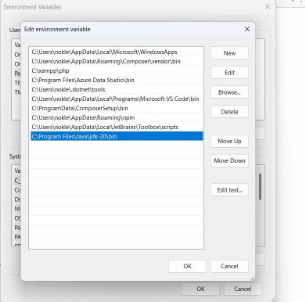

2. Buka Command Prompt (Wind+R, kemudian ketik cmd), selanjutnya ketikan perintah javac , jika perintah tersebut dikenali maka lingkungan operasi Windows telah mendukung program java, tetapi jika belum dikenali lakukan pengecekan pada setting PATH (dimungkinkan ada kesalahan ketika memasukkan lokasi direktori bin di variabel PATH). 

   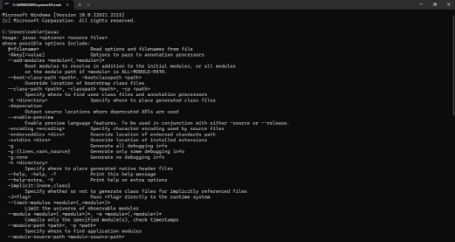

2 

**Laporan Pemrogaman WEB Lanjut-Jobsheet 2** 
**Laporan Pemrogaman WEB Lanjut Jobsheet 2 ![ref1]![ref2]**

**1. Langkah Langkah Praktikum** 

1. **Basic Routing** 
1. Q: Buka file routes/web.php. Tambahkan sebuah route untuk nomor 1 seperti di bawah ini: 

   A:  

Route::get('/hello', function () {      return 'Hello World';  

`    `});  

2. Q: Buka browser, tuliskan URL untuk memanggil route tersebut: localhost/PWL\_2024/public/hello. Perhatikan halaman yang muncul apakah sudah sesuai dan jelaskan pengamatan Anda. 

   A: 

|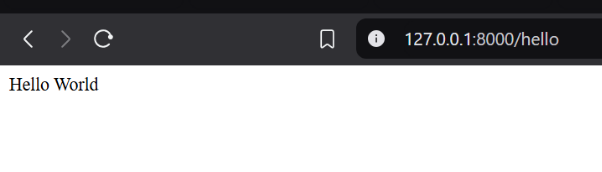|
| - |
|Halaman web akan menampilkan hello world karena address hello mempunyai fungsi yang mereturn hello world |

3. Q: Bukalah pada browser, tuliskan URL untuk memanggil route tersebut: localhost/PWL\_2024/public/world. Perhatikan halaman yang muncul apakah sudah sesuai dan jelaskan pengamatan Anda. 

   A:  

|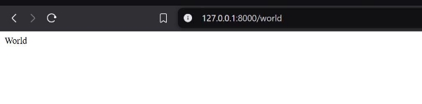|
| - |
|Sama seperti pada nomor 2, namun returnya kali ini adalah world dalam bentu String |

2 

**Laporan Pemrogaman WEB Lanjut-Jobsheet 2** 
**Laporan Pemrogaman WEB Lanjut Jobsheet 2 ![ref1]![ref2]**

4. Q: Selanjutnya, cobalah membuat route ’/’ yang menampilkan pesan ‘Selamat Datang’. A:  

|Route::get('/welcome', function () { |
| - |
|return 'Selamat Datang Noklent'; |
|}); |
||
|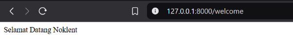|

5. Q: Kemudian buatlah route ‘/about’ yang akan menampilkan NIM dan nama Anda. A: 

|Route::get('/about', function () { |
| - |
|return 'NIM : 2341720082 , Nama : Noklent Fardian'; |
|}); |
||
|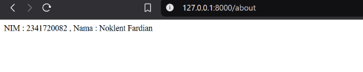|

2. **Route Paramater** 
1. Q: Jalankan kode dengan menuliskan URL untuk memanggil route tersebut: localhost/PWL\_2024/public/user/NamaAnda. Perhatikan halaman yang muncul dan jelaskan pengamatan Anda. 

   A:  

   |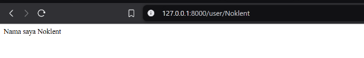|
   | - |
   |Halaman akan memunculkan nama yang sama dengan address |

2. Q: Jalankan kode dengan menuliskan URL untuk memanggil route tersebut: localhost/PWL\_2024/public/posts/1/comments/5. Perhatikan halaman yang muncul dan jelaskan pengamatan Anda. 

   A:  

2 

**Laporan Pemrogaman WEB Lanjut-Jobsheet 2** 
**Laporan Pemrogaman WEB Lanjut Jobsheet 2 ![ref1]![ref2]**

|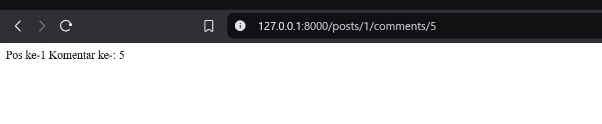|
| - |
|Menampilkan postingan id  1 dan comment id 5 |

3. Q: Kemudian buatlah route /articles/{id} yang akan menampilkan output “Halaman Artikel dengan ID {id}”, ganti id sesuai dengan input dari url. 

   A:  

|Route::get('/article/{id}', function ($id) { |
| - |
|return 'Halaman Artikel  dengan ID  ' . $id; |
|}); |
||
|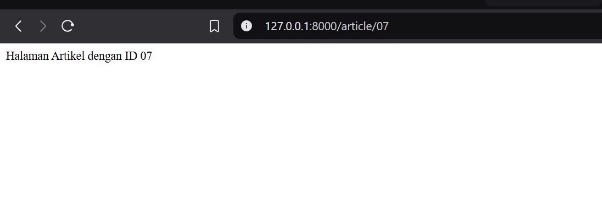|

3. **Optional Parameters** 
1. Q: Jalankan kode dengan menuliskan URL: localhost/PWL\_2024/public/user/. Perhatikan halaman yang muncul dan jelaskan pengamatan Anda. 

   |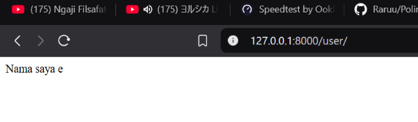|
   | - |
   |Setelah nama saya akan kosong karena url juga null |

2. Q: Jalankan kode dengan menuliskan URL: localhost/PWL\_2024/public/user/. Perhatikan halaman yang muncul dan jelaskan pengamatan Anda. 

2 

**Laporan Pemrogaman WEB Lanjut-Jobsheet 2** 
**Laporan Pemrogaman WEB Lanjut Jobsheet 2 ![ref1]![ref2]**

|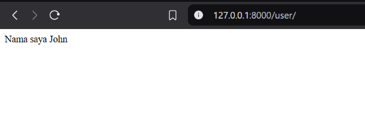|
| - |
|Karena pada codingan variable sudah diberi value maka hasil return juga akan berpengaruh |

4. **Membuat Controller** 
1. Code pada WelcomeControlller 

   ||
   | :- |
   |<?php |
   ||
   |namespace App\Http\Controllers; |
   ||
   |use Illuminate\Http\Request; |
   ||
   |class WelcomeController extends Controller |
   |{ |
   |public function hello() |
   |{ |
   |return 'Hello World'; |
   |} |
   ||
   ||
2. Q: Buka browser, tuliskan URL untuk memanggil route tersebut: localhost/PWL\_2024/public/hello. Perhatikan halaman yang muncul dan jelaskan pengamatan Anda. 

   |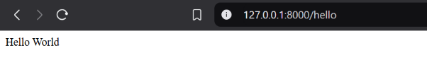|
   | - |
   |Routing akan memanggil function hello pada welcomeController |

2 

**Laporan Pemrogaman WEB Lanjut-Jobsheet 2** 
**Laporan Pemrogaman WEB Lanjut Jobsheet 2 ![ref1]![ref2]**

3. Q: Modifikasi hasil pada praktikum poin 2 (Routing) dengan konsep controller. Pindahkan logika eksekusi ke dalam controller dengan nama PageController.  A:  

|**PageController** |
| - |
|<?php |
||
|namespace App\Http\Controllers; |
||
|use Illuminate\Http\Request; |
||
|class PageController extends Controller |
|{ |
|public function index() |
|{ |
|return 'Selamat Datang'; |
|} |
|public function about() |
|{ |
|return 'NIM : 2341720082 , Nama : Noklent Fardian'; |
|} |
|public function articles($id) |
|{ |
|return 'Halaman Artikel  dengan ID  ' . $id; |
|} |
|} |
||
|WEB |
|use App\Http\Controllers\PageController; |
||
|Route::get('/', [PageController::class, 'index']); |
|Route::get('/about', [PageController::class, 'about']); |
|Route::get('/articles/{id}', [PageController::class, 'articles']); |
||
|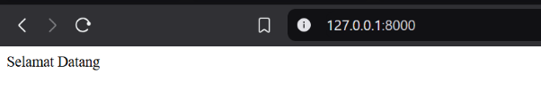|

2 

**Laporan Pemrogaman WEB Lanjut-Jobsheet 2** 
**Laporan Pemrogaman WEB Lanjut Jobsheet 2 ![ref1]![ref2]**

|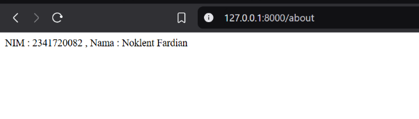|
| - |
|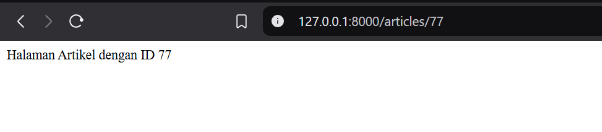|

4. Q: Modifikasi kembali implementasi sebelumnya dengan konsep Single Action Controller. Sehingga untuk hasil akhir yang didapatkan akan ada HomeController, AboutController dan ArticleController. Modifikasi juga route yang digunakan. 

|**Home Controller** |
| - |
|<?php |
||
|namespace App\Http\Controllers; |
||
|use Illuminate\Http\Request; |
||
|class HomeController extends Controller |
|{ |
|public function index() |
|{ |
|` `return 'Selamat Datang Singe action Controller'; |
|} |
|} |
||
||
|Route::get('/', [HomeController::class,'index']); |
||
|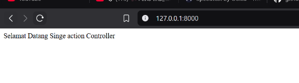|
|AboutController |

2 

**Laporan Pemrogaman WEB Lanjut-Jobsheet 2** 
**Laporan Pemrogaman WEB Lanjut Jobsheet 2 ![ref1]![ref2]**

|<?php |
| - |
||
|namespace App\Http\Controllers; |
||
|use Illuminate\Http\Request; |
||
|class AboutContoller extends Controller |
|{ |
|public function about() |
|{ |
|return 'NIM : 2341720082 , Nama : Noklent Fardian'; |
|} |
|} |
||
||
|Route::get('/about', [AboutContoller::class, about |
|]); |
||
|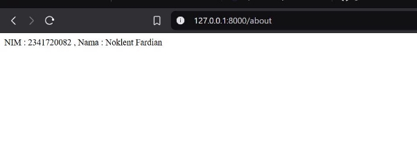|
|Article COntroller |
|<?php |
||
|namespace App\Http\Controllers; |
||
|use Illuminate\Http\Request; |
||
|class ArticleContoller extends Controller |
|{ |
|public function articles($id) |
|{ |
|return 'Halaman Artikel  dengan ID  ' . $id; |
|} |
|} |
||
||
|Route::get('/articles', [ArticleContoller::class,'articles']); |
||

2 

**Laporan Pemrogaman WEB Lanjut-Jobsheet 2** 
**Laporan Pemrogaman WEB Lanjut Jobsheet 2 ![ref1]**

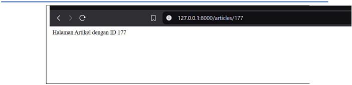

5. **Controller resource** 

   1\.  Q: Jalankan cek list route (php artisan route:list) akan dihasilkan route berikut ini. 

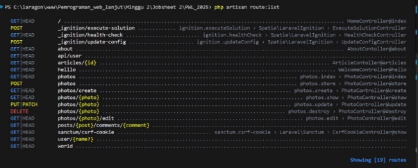

6. **Membuat view** 

   1\.  Q: Jalankan code dengan membuka url localhost/PWL\_2024/public/greeting. 

Perhatikan halaman yang muncul dan jelaskan pengamatan Anda. 

Pada URL /greeting akan menampikan isi dari file hello.balde.php dan 

variablenama diisi pada routing. 

2 

**Laporan Pemrogaman WEB Lanjut-Jobsheet 2** 
**Laporan Pemrogaman WEB Lanjut Jobsheet 2 ![ref1]![ref2]**

**1.7Menampilkan View dari Controller** 

1\. 

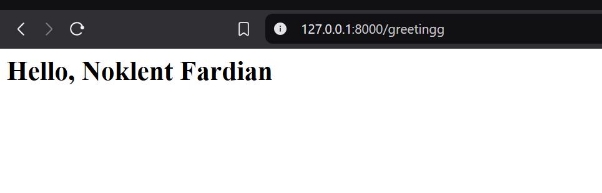

Controller akan memanggi fungsi greeting pada WelcomeController yang berisi file blog.hello 

**1.8 Meneruskan data ke view** 

1. 

2 

**Laporan Pemrogaman WEB Lanjut-Jobsheet 2** 
**Laporan Pemrogaman WEB Lanjut Jobsheet 2 ![ref1]![ref2]**

2. **TUGAS** 

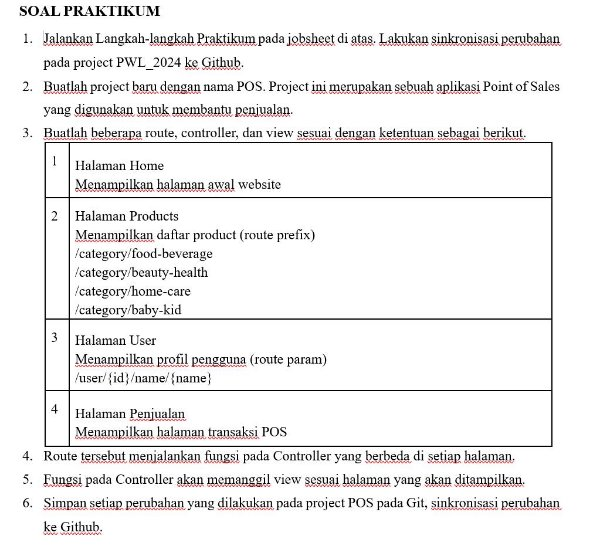

**Jawab** 

1\.  Q: Buatlah project baru dengan nama POS. Project ini merupakan sebuah aplikasi Point of 

Sales yang digunakan untuk membantu penjualan. 

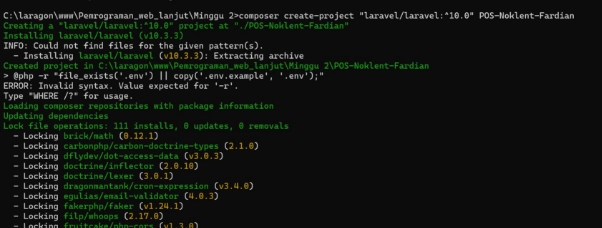

2 

**Laporan Pemrogaman WEB Lanjut-Jobsheet 2** 
**Laporan Pemrogaman WEB Lanjut Jobsheet 2 ![ref1]![ref2]**

**2: Home Section** 

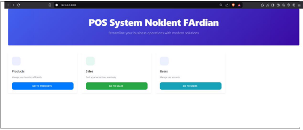

**3: Product Section** 

<?php 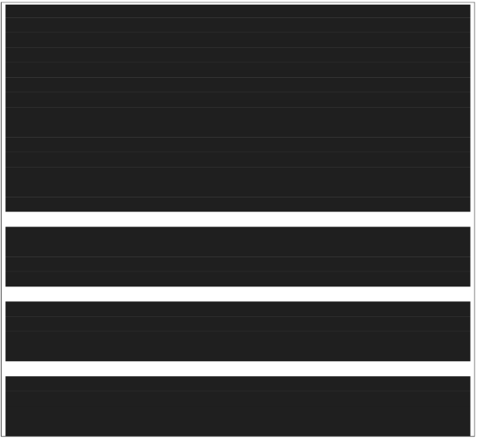

namespace App\Http\Controllers; use Illuminate\Http\Request; 

class ProductController extends Controller 

{ 

`    `public function index() 

`    `{ 

`        `return view('product.index'); 

`    `} 

`    `public function foodBeverage() 

`    `{ 

`        `return view('product.category', ['category' => 'Food & Beverage']);     } 

`    `public function beautyHealth() 

`    `{ 

`        `return view('product.category', ['category' => 'Beauty & Health']);     } 

`    `public function homeCare() 

`    `{ 

`        `return view('product.category', ['category' => 'Home Care']);     } 

public function babyKid() { 

2 

**Laporan Pemrogaman WEB Lanjut-Jobsheet 2** 
**Laporan Pemrogaman WEB Lanjut Jobsheet 2 ![ref1]![ref2]**

|return view('product.category', ['category' => 'Baby & Kid']); |
| - |
|} |
|} |
||
||
|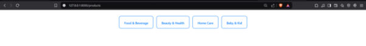|
|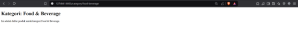|
|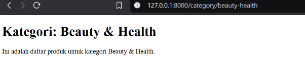|
|
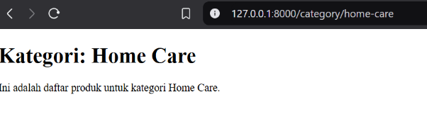

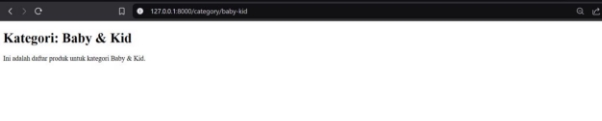
|
||

2 

**Laporan Pemrogaman WEB Lanjut-Jobsheet 2** 
**Laporan Pemrogaman WEB Lanjut Jobsheet 2 ![ref1]![ref2]**

**4: User Section** 

|<?php |
| - |
||
|namespace App\Http\Controllers; |
||
|use Illuminate\Http\Request; |
||
|class UserController extends Controller |
|{ |
||
|public function profile($id, $name) |
|{ |
|return view('user.index', [ |
|'id' => $id, |
|'name' => $name, |
|]); |
|} |
|} |
||
||
|Route::get('/user/{id}/name/{name}', [UserController::class, 'profile']) -|
|>name('user.profile'); |
||
|<a href="{{ route('user.profile', ['id' => '234710082', 'name' => |
|'Nokklent Fardian']) }}" class="btn btn-info w-100 btn-modern"> |
||
|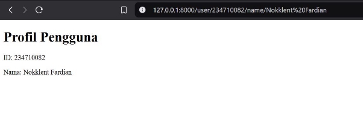|

2 

**Laporan Pemrogaman WEB Lanjut-Jobsheet 2** 
**Laporan Pemrogaman WEB Lanjut Jobsheet 2 ![ref1]![ref2]**

**5.  Sales Section** 

|<?php |
| - |
||
|namespace App\Http\Controllers; |
||
|use Illuminate\Http\Request; |
||
|class SalesController extends Controller |
|{ |
|public function index() |
|{ |
|return view('sales.index'); |
|} |
|} |
||
|Route::get('/sales', [SalesController::class, 'index'])-|
|>name('sales.index'); |
||
|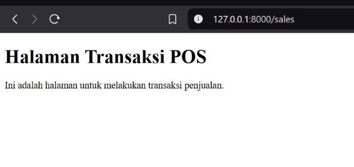|

2 

**Laporan Pemrogaman WEB Lanjut-Jobsheet 2** 

[ref1]: Aspose.Words.32982064-6537-4203-8b17-b50586eb8bf2.002.png
[ref2]: Aspose.Words.32982064-6537-4203-8b17-b50586eb8bf2.003.png
