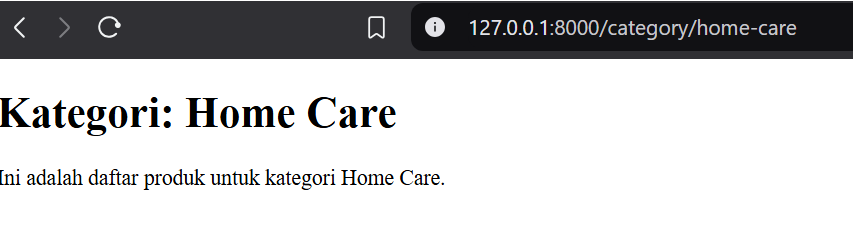

> Laporan Pemrogaman WEB Lanjut Jobsheet 2
>
> Politeknik Negeri Malang Semester 4 2025
>
> **NIM** 2341720082
>
> **Nama** Noklent Fardian Erix
>
> **Kelas** 2A
>
> **Jurusan** Teknologi Informasi
>
> **Progam** **Studi**
>
> D-IV Teknik Informatika
>
> **Laporan**
> **Pemrogaman** **WEB** **Lanjut** **Jobsheet**
> **2** style="width:3.17847in;height:3.14514in" /> style="width:4.74167in;height:2.51875in" />
>
> **1.** **Pratikum**
>
> **1.1** **Percobaan** **1:** **Melakukan** **Instalasi** **Java**
> **Development** **Kit/JDK**
>
> 1\. Cara seting PATH adalah buka Control Panel-\> System-\> Advanced
> System Seting-\> Environment Variabel. Kemudian cari variabel PATH.
>
> Contoh : C:\Progam Files\Java\jdk-20\bin
>
> 2\. Buka Command Prompt (Wind+R, kemudian ketik cmd), selanjutnya
> ketikan perintah
>
> javac , jika perintah tersebut dikenali maka lingkungan operasi
> Windows telah
>
> mendukung program java, tetapi jika belum dikenali lakukan pengecekan
> pada seting
>
> PATH (dimungkinkan ada kesalahan ketika memasukkan lokasi direktori
> bin di variabel
>
> PATH).

1 **Laporan** **Pemrogaman** **WEB** **Lanjut-Jobsheet** **2**

> **Laporan**
> **Pemrogaman** **WEB** **Lanjut** **Jobsheet**
> **2** style="width:6.26805in;height:1.78958in" /> style="width:6.26805in;height:1.54792in" />
>
> **1.** **Langkah** **Langkah** **Praktikum** **1.1** **Basic**
> **Routing**
>
> 1\. Q: Buka file routes/web.php. Tambahkan sebuah route untuk nomor 1
> seperti di bawah ini:
>
> A:

Route::get('/hello', function () { return 'Hello World';

> });
>
> 2\. Q: Buka browser, tuliskan URL untuk memanggil route tersebut:
> localhost/PWL_2024/public/hello. Perhatikan halaman yang muncul apakah
> sudah sesuai dan jelaskan pengamatan Anda.
>
> A:
>
> 3\. Q: Bukalah pada browser, tuliskan URL untuk memanggil route
> tersebut: localhost/PWL_2024/public/world. Perhatikan halaman yang
> muncul apakah sudah sesuai dan jelaskan pengamatan Anda.
>
> A:

2 **Laporan** **Pemrogaman** **WEB** **Lanjut-Jobsheet** **2**

> **Laporan**
> **Pemrogaman** **WEB** **Lanjut** **Jobsheet**
> **2** style="width:6.26805in;height:1.20625in" /> style="width:6.26805in;height:1.24792in" /> style="width:6.26805in;height:0.99653in" />
>
> 4\. Q: Selanjutnya, cobalah membuat route ’/’ yang menampilkan pesan
> ‘Selamat Datang’. A:
>
> 5\. Q: Kemudian buatlah route ‘/about’ yang akan menampilkan NIM dan
> nama Anda. A:
>
> **1.2Route** **Paramater**
>
> 1\. Q: Jalankan kode dengan menuliskan URL untuk memanggil route
> tersebut: localhost/PWL_2024/public/user/NamaAnda. Perhatikan halaman
> yang muncul dan jelaskan pengamatan Anda.
>
> A:
>
> 2\. Q: Jalankan kode dengan menuliskan URL untuk memanggil route
> tersebut: localhost/PWL_2024/public/posts/1/comments/5. Perhatikan
> halaman yang muncul dan jelaskan pengamatan Anda.
>
> A:

3 **Laporan** **Pemrogaman** **WEB** **Lanjut-Jobsheet** **2**

> **Laporan**
> **Pemrogaman** **WEB** **Lanjut** **Jobsheet**
> **2** style="width:6.26805in;height:1.29236in" /> style="width:6.26805in;height:2.0875in" />
>
> 3\. Q: Kemudian buatlah route /articles/{id} yang akan menampilkan
> output “Halaman Artikel dengan ID {id}”, ganti id sesuai dengan input
> dari url.
>
> A:
>
> **1.3** **Optional** **Parameters**
>
>  style="width:6.26805in;height:1.82986in" />1. Q: Jalankan kode dengan
> menuliskan URL: localhost/PWL_2024/public/user/. Perhatikan halaman
> yang muncul dan jelaskan pengamatan Anda.
>
> 2\. Q: Jalankan kode dengan menuliskan URL:
> localhost/PWL_2024/public/user/. Perhatikan halaman yang muncul dan
> jelaskan pengamatan Anda.

4 **Laporan** **Pemrogaman** **WEB** **Lanjut-Jobsheet** **2**

> **Laporan**
> **Pemrogaman** **WEB** **Lanjut** **Jobsheet**
> **2** style="width:6.26805in;height:2.13472in" /> style="width:6.26805in;height:0.95556in" />
>
> **1.4** **Membuat** **Controller**
>
> 1\. Code pada WelcomeControlller
>
> 2\. Q: Buka browser, tuliskan URL untuk memanggil route tersebut:
> localhost/PWL_2024/public/hello. Perhatikan halaman yang muncul dan
> jelaskan pengamatan Anda.

5 **Laporan** **Pemrogaman** **WEB** **Lanjut-Jobsheet** **2**

> **Laporan**
> **Pemrogaman** **WEB** **Lanjut** **Jobsheet**
> **2** style="width:6.26805in;height:1.24236in" />
>
> 3\. Q: Modifikasi hasil pada praktikum poin 2 (Routing) dengan konsep
> controller. Pindahkan logika eksekusi ke dalam controller dengan nama
> PageController. A:

6 **Laporan** **Pemrogaman** **WEB** **Lanjut-Jobsheet** **2**

> **Laporan**
> **Pemrogaman** **WEB** **Lanjut** **Jobsheet**
> **2** style="width:6.26805in;height:1.7875in" /> style="width:6.26805in;height:1.37222in" /> style="width:6.26805in;height:1.72986in" />
>
> 4\. Q: Modifikasi kembali implementasi sebelumnya dengan konsep Single
> Action Controller. Sehingga untuk hasil akhir yang didapatkan akan ada
> HomeController, AboutController dan ArticleController. Modifikasi juga
> route yang digunakan.

7 **Laporan** **Pemrogaman** **WEB** **Lanjut-Jobsheet** **2**

> **Laporan**
> **Pemrogaman** **WEB** **Lanjut** **Jobsheet**
> **2** style="width:6.26805in;height:2.52014in" />

8 **Laporan** **Pemrogaman** **WEB** **Lanjut-Jobsheet** **2**

> **Laporan**
> **Pemrogaman** **WEB** **Lanjut** **Jobsheet**
> **2** style="width:6.26805in;height:1.61528in" /> style="width:6.26805in;height:2.53611in" /> style="width:4.84986in;height:1.87847in" />
>
> **1.5** **Controller** **resource**
>
> 1\. Q: Jalankan cek list route (php artisan route:list) akan
> dihasilkan route berikut ini.
>
> **1.6** **Membuat** **view**
>
> 1\. Q: Jalankan code dengan membuka url
> localhost/PWL_2024/public/greeting. Perhatikan halaman yang muncul dan
> jelaskan pengamatan Anda.

Pada URL /greeting akan menampikan isi dari file hello.balde.php dan
variablenama diisi pada routing.

9 **Laporan** **Pemrogaman** **WEB** **Lanjut-Jobsheet** **2**

> **Laporan**
> **Pemrogaman** **WEB** **Lanjut** **Jobsheet**
> **2** style="width:6.26805in;height:2.00903in" />

**1.7Menampilkan** **View** **dari** **Controller** 1.

Controller akan memanggi fungsi greeting pada WelcomeController yang
berisi file blog.hello

> **1.8** **Meneruskan** **data** **ke** **view**
>
>  style="width:6.26805in;height:2.79931in" />1.

10 **Laporan** **Pemrogaman** **WEB** **Lanjut-Jobsheet** **2**

> **Laporan**
> **Pemrogaman** **WEB** **Lanjut** **Jobsheet**
> **2** style="width:6.26805in;height:5.80347in" /> style="width:6.26805in;height:2.37986in" />
>
> **2.** **TUGAS**

**Jawab**

> 1\. Q: Buatlah project baru dengan nama POS. Project ini merupakan
> sebuah aplikasi Point of Sales yang digunakan untuk membantu
> penjualan.

11 **Laporan** **Pemrogaman** **WEB** **Lanjut-Jobsheet** **2**

> **Laporan**
> **Pemrogaman** **WEB** **Lanjut** **Jobsheet**
> **2** style="width:6.26806in;height:2.65764in" />

**2:** **Home** **Section**

**3:** **Product** **Section**

||
||
||

12 **Laporan** **Pemrogaman** **WEB** **Lanjut-Jobsheet** **2**

> **Laporan**
> **Pemrogaman** **WEB** **Lanjut** **Jobsheet**
> **2** style="width:6.26806in;height:0.79861in" /> style="width:6.26806in;height:0.91875in" /> style="width:6.26806in;height:1.48264in" /> style="width:6.26806in;height:1.66875in" /> style="width:6.26806in;height:1.25555in" />

13 **Laporan** **Pemrogaman** **WEB** **Lanjut-Jobsheet** **2**

> **Laporan**
> **Pemrogaman** **WEB** **Lanjut** **Jobsheet**
> **2** style="width:6.26806in;height:2.14722in" />
>
> **4:** **User** **Section**

14 **Laporan** **Pemrogaman** **WEB** **Lanjut-Jobsheet** **2**

> **Laporan**
> **Pemrogaman** **WEB** **Lanjut** **Jobsheet**
> **2** style="width:6.26806in;height:2.96528in" />
>
> **5.** **Sales** **Section**

15 **Laporan** **Pemrogaman** **WEB** **Lanjut-Jobsheet** **2**
