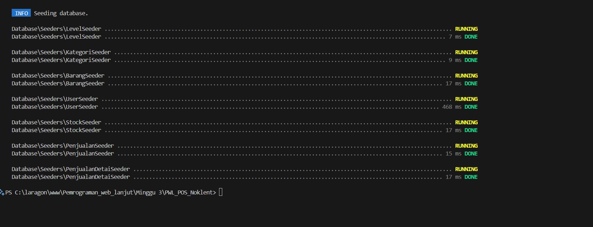
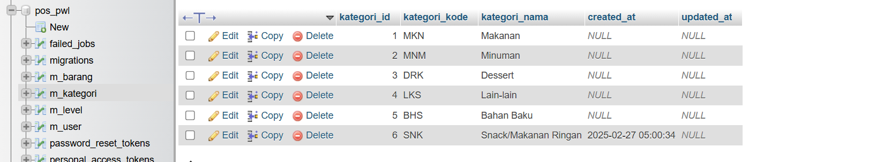

> Laporan Pemrogaman WEB Lanjut

Jobsheet 3 MIGRATION, SEEDER, DB FAÇADE, QUERY BUILDER, dan ELOQUENT ORM

> Politeknik Negeri Malang Semester 4 2025
>
> **NIM** 2341720082
>
> **Nama** Noklent Fardian Erix
>
> **Kelas** 2A
>
> **Jurusan** Teknologi Informasi
>
> **Progam** **Studi**
>
> D-IV Teknik Informatika

**Praktikum** **1** **PENGATURAN** **DATABASE**

> 1\. Q: Edit file .env dan sesuaikan dengan database yang telah dibuat
> A:

**Praktikum** **2** **:MIGRATIONS**

> 1\. Q: Simpan kode pada tahapan 4 tersebut, kemudian jalankan perintah
> ini pada terminal VSCode untuk melakukan migrasi
>
>  style="width:6.26805in;height:1.70556in" /> style="width:6.26806in;height:1.32153in" />A:

> 2\. Q: Buat table database dengan migration untuk table m_kategori
> yang sama-sama tidak memiliki foreign key
>
> A: Ketik Commanf berikut

**Praktikum** **2.2** **-** **Pembuatan** **file** **migrasi**
**dengan** **relasi**

> 1\. Q: Simpan kode program Langkah 2, dan jalankan perintah php
> artisan migrate. Amati apa yang terjadi pada database.
>
>  style="width:6.26805in;height:1.05278in" />A: Tabel m_user akan dibuat
> pada database

> 2\. Q

A: Pada migrations

Pada designer mysql

**Praktikum** **3** **–** **Membuat** **file** **seeder** 1. Q:

> A:
>
> File seeder yang telah dibuat

> Running seder

**Praktikum** **4** **–** **Implementasi** **DB** **Façade**

> 1\. Q: Kita coba jalankan di browser dengan url
> localhost/PWL_POS/public/level lagi dan amati apa yang terjadi pada
> table m_level di database, screenshot perubahan yang ada pada table
> m_level
>
>  style="width:4.68222in;height:2.19583in" />A: Jika saat pertama kali
> Alamat /level diketik pada url maka halaman akan memunculkan tulisan
> insert data berhasil, dan record akan bertambah pada databse

> 2\. Q: Kita coba jalankan di browser dengan url
> localhost/PWL_POS/public/level lagi dan amati apa yang terjadi pada
> table m_level di database, screenshot perubahan yang ada pada table
> m_level
>
> A:
>
> 3\. Q : Kita coba modifikasi lagi file LevelController untuk melakukan
> proses hapus data
>
>  style="width:4.82194in;height:1.19722in" /> style="width:4.90958in;height:1.46319in" />A:

> 4\. Q : Coba kita perhatikan kode yang diberi tanda kotak merah,
> berhubung kode tersebut memanggil view(‘level’), maka kita buat file
> view pada VSCode di PWL_POS/resources/view/level.blade.php
>
> A:
>
> **5.** **QUERY** **BUILDER**
>
> 1\. Q: Kita coba jalankan insert di browser dengan url
> localhost/PWL_POS/public/kategori dan amati apa yang terjadi pada
> table m_kategori di database, screenshot perubahan yang ada pada table
> m_kategori
>
>  style="width:6.26805in;height:1.33819in" /> style="width:6.26805in;height:1.14167in" />A:

> 2\. Q: Selanjutnya, kita modifikasi lagi file KategoriController untuk
> meng-update data di table m_kategori seperti berikut
>
> A:
>
>  style="width:6.26805in;height:1.36319in" />3. Q: Kita coba modifikasi
> lagi file KategoriController untuk melakukan proses hapus data A:
>
> 4\. Q: Silahkan dicoba pada browser dan amati apa yang terjadi.
>
>  style="width:6.26805in;height:1.79444in" />A: Setelah menambahkan
> qeuri builder pada KategoriController yang untuk mengread lalu
> diretrun ke view/kategori maka halaman web akan memunculkan tampilan
> table yang berisi data pada table kategori

**6.** **Praktikum** **6** **–** **Implementasi** **Eloquent** **ORM**
1.

2\.

7\. **Jawablah** **pertanyaan** **berikut** **sesuai** **pemahaman**
**materi** **di** **atas**

> 1\. Q: Pada Praktikum 1 - Tahap 5, apakah fungsi dari APP_KEY pada
> file seting .env Laravel? A: digunakan sebagai keamanan untuk enkripsi
> dan dekripsi data dalam aplikasi Laravel. Ini termasuk enkripsi
> cookie, session, dan data sensitif lainnya.
>
> 2\. Q: Pada Praktikum 1, bagaimana kita men-generate nilai untuk
> APP_KEY? A: Ketik php artisan key:generate pada command line
>
> 3\. Q: Pada Praktikum 2.1 - Tahap 1, secara default Laravel memiliki
> berapa file migrasi? dan untuk apa saja file migrasi tersebut?
>
> • A: laravelmemiliki 4 default file migrasi, yaitu:
>
> o create_users_table.php: untuk membuat tabel user
>
> o create_password_reset_tokens_table.php: untuk membuat tabel
> password_reset_tokens yang berfungsi menyimpan token reset password
>
> o create_failed_jobs_table.php: untuk membuat tabel failed_jobs yang
> menyimpan data pekerjaan (job) yang gagal diproses
>
> o create_personal_access_tokens_table.php: untuk membuat table acces
> tokens table
>
> 4\. Q: Secara default, file migrasi terdapat kode
> \$table-\>timestamps();, apa tujuan/output dari fungsi tersebut?
>
> A: menambahkan dua kolom timestamp ke dalam tabel, yaitu:
>
> • created_at: Menyimpan waktu dengan tepat ketika record baru pertama
> kali dibuat. • updated_at: Menyimpan data waktu ketika record terakhir
> kali diubah.
>
> 5\. Q: : Pada File Migrasi, terdapat fungsi \$table-\>id(); Tipe data
> apa yang dihasilkan dari fungsi tersebut?
>
> A: Syntax tersebut akan membuat field yang bertipe unsigned big
> integer dan primary key
>
> 6\. . Q: Apa bedanya hasil migrasi pada table m_level, antara
> menggunakan \$table-\>id(); dengan menggunakan
> \$table-\>id('level_id'); ?
>
> A : Jika menggunakan \$table-\<id(); nanti field yang akan Bernama id
> saja dan berperan sebagai primary key, jika satunya nama tablenya akan
> Bernama ‘level_id’
>
> 7\. Q : Pada migration, Fungsi -\>unique() digunakan untuk apa?
>
> A: untuk memastikan data record baru pada suatu kolum tidak ada yang
> duplikat
>
> 8\. Q: Pada Praktikum 2.2 - Tahap 2, kenapa kolom level_id pada tabel
> m_user menggunakan \$tabel-\>unsignedBigInteger('level_id'), sedangkan
> kolom level_id pada tabel m_level menggunakan \$tabel-\>id('level_id')
> ?
>
> A: Karena pada table m_level itu sebagai primary key, sedangkan pada
> m_user sebagai foreign key
>
> 9\. Q: Pada Praktikum 3 - Tahap 6, apa tujuan dari Class Hash? dan apa
> maksud dari kode program Hash::make('1234');?
>
> A: akan merubah value data menjadi string karakter dengan panjang
> tetap untuk merahasiakan value aslinya
>
> 10\. Q: Pada Praktikum 4 - Tahap 3/5/7, pada query builder terdapat
> tanda tanya (?), apa kegunaan dari tanda tanya (?) tersebut?
>
> A: digunakan sebagai placeholder untuk nilai yang akan diikat (bind)
> ke query. Nilai tersebut akan diisi nanti, biasanya dalam bentuk
> array.
>
> 11\. Q: Pada Praktikum 6 - Tahap 3, apa tujuan penulisan kode
> protected \$table = ‘m_user’; dan protected \$primaryKey = ‘user_id’;
> ?
>
> A:
>
> protected \$table = ‘m_user’; digunakan untuk mendefiniskan table yang
> dipakai untuk model tersebut, dan protected \$primaryKey = ‘user_id’;
> ? figunakan untuk mendefinikan field mana yang menjadi primary key
>
> **12.** Q: **12.** **Menurut** **kalian,** **lebih** **mudah**
> **menggunakan** **mana** **dalam** **melakukan** **operasi** **CRUD**
> **ke** **database** **(DB** **Façade** **/** **Query** **Builder**
> **/** **Eloquent** **ORM)?** **jelaskan**
>
> A **Eloquent** **ORM** **:** **karena** **Mengurangi** **kode**
> **berulang-ulang** **untuk** **interaksi** **database.**
> **Menyederhanakan** **query** **yang** **kompleks.** **Menjaga**
> **konsistensi** **dan** **keamanan** **dalam** **interaksi**
> **database.** **Memudahkan** **pengelolaan** **hubungan** **antar**
> **tabel** **database**
