

# Laporan Pemrogaman WEB Lanjut Jobsheet 4 MODEL dan ELOQUENT ORM

## Politeknik Negeri Malang Semester 4 2025

**NIM:** 2341720082

**Nama:** Noklent Fardian Erix

**Kelas:** 2A

**Jurusan:** Teknologi Informasi

**Program Studi:** D-IV Teknik Informatika

> **1.** **Praktikum**
>
> **1.1** **Praktikum** **1** **\$fillable:**
>
> 1\. Q: Simpan kode program Langkah 1 dan 2, dan jalankan perintah web
> server. Kemudian jalankan link localhostPWL_POS/public/user pada
> browser dan amati apa yang terjadi
>
> 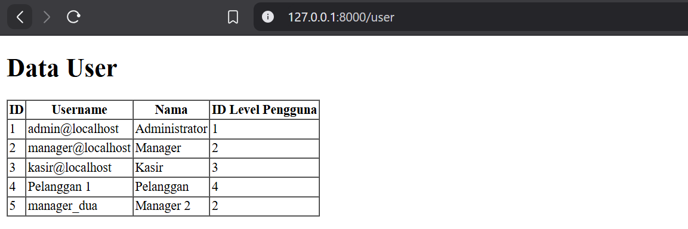 style="width:6.26805in;height:2.0875in" />
A: Kode tersebut akan membuat record baru dengan username : manager_dua pada 
table user 

> 2\.Q: Simpan kode program Langkah 4 dan 5. Kemudian jalankan pada browser
dan amati apa yang terjadi

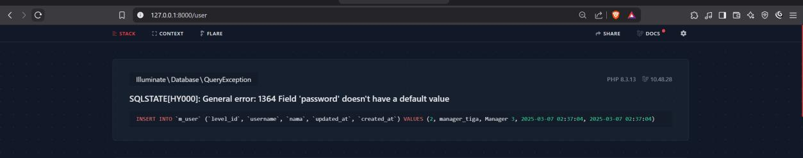

> A:
> Akan terjadi tampilan error karena adanya konflik antara model dan
> controller, di mana dalam kasus ini kolom password pada model tidak
> didefiniskan, namun pada fungsi create terdapat array yang terdapat
> index

> **2.1Praktikum** **2** **–** **Retrieving** **Single** **Models**
>
> 1\. Q: Simpan kode program Langkah 1 dan 2. Kemudian jalankan pada
> browser dan amati apa yang terjadi dan beri penjelasan dalam laporan
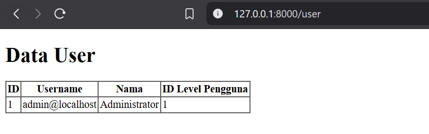
> A:
>
> Program tersebut akan hanya mengambil data m_user untuk index ke 1
>
> 2\. Q: Simpan kode program Langkah 4. Kemudian jalankan pada browser
> dan amati apa yang terjadi dan beri penjelasan dalam laporan
>
> A:
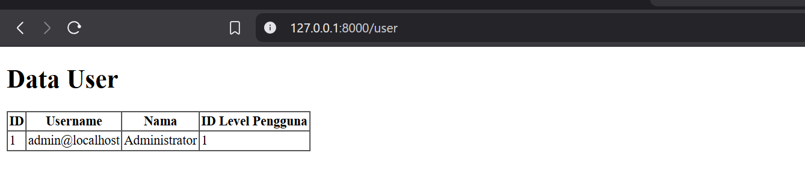
Ketiga syntax terbsebut akan mempunyai output yang sama yaitu akan
mengprint record pertama.

> 3\. Q: Simpan kode program Langkah 8. Kemudian pada browser dan amati
> apa yang terjadi dan beri penjelasan dalam laporan
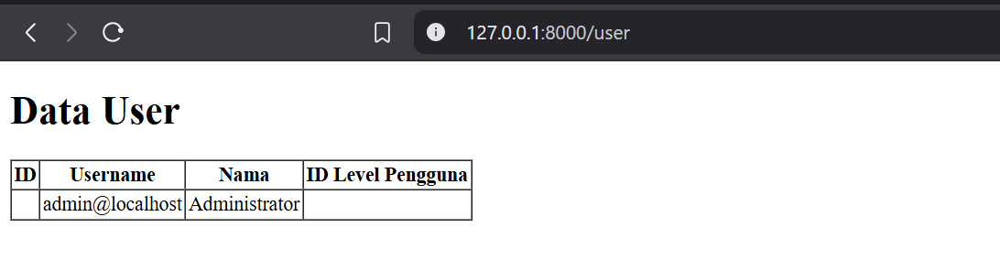
> A:
>
> Program tersebut akan mencari id 1, jika idnya tidak ditemukan maka
> akan muncul halaman not found.
>
> 4\. Q: Simpan kode program Langkah 10. Kemudian jalankan pada browser
> dan amati apa yang terjadi dan beri penjelasan dalam laporan
>
> A: Akan muncul halaman error 404 karena id 21 tidak ditemukan.

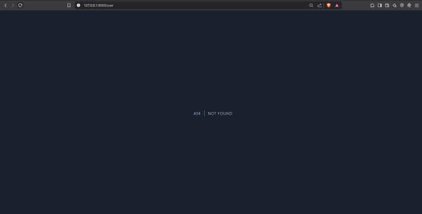

**Praktikum** **2.2** **–** **Not** **Found** **Exceptions**

> 1\. Q: Simpan kode program Langkah 1. Kemudian jalankan pada browser
> dan amati apa yang terjadi dan beri penjelasan dalam laporan
>
> 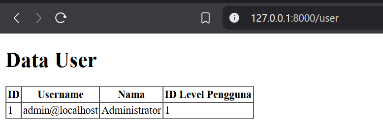A:
>
> 2\. Q: Simpan kode program Langkah 3. Kemudian jalankan pada browser
> dan amati apa yang terjadi dan beri penjelasan dalam laporan
>
> 
A:

> Akan muncul halaman erorr 404 karena username manager9 tidak ditemukan

**Praktikum** **2.3** **–** **Retreiving** **Aggregrates**

> 1\. Q: Simpan kode program Langkah 1. Kemudian jalankan pada browser
> dan amati apa yang terjadi dan beri penjelasan dalam laporan
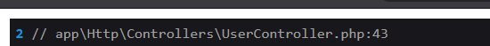
> A:
>
> Akan mempunyai output dari menghitung berapa record yang mempunyai
> user_level 2
>
> 2\. Q: Buat agar jumlah script pada langkah 1 bisa tampil pada halaman
> browser, sebagai contoh bisa lihat gambar di bawah ini dan ubah script
> pada file view supaya bisa muncul datanya
>
> 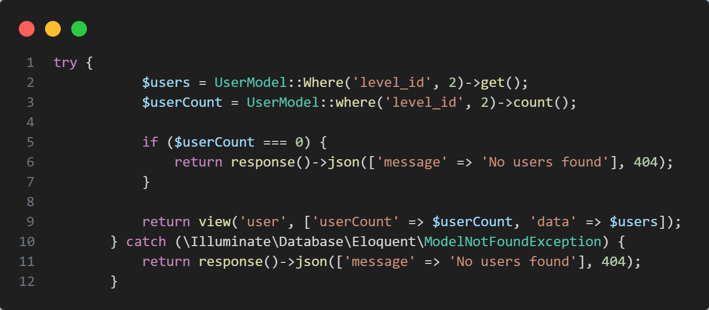
 A: Ubah kode UserController
> menjadi seperti berikut

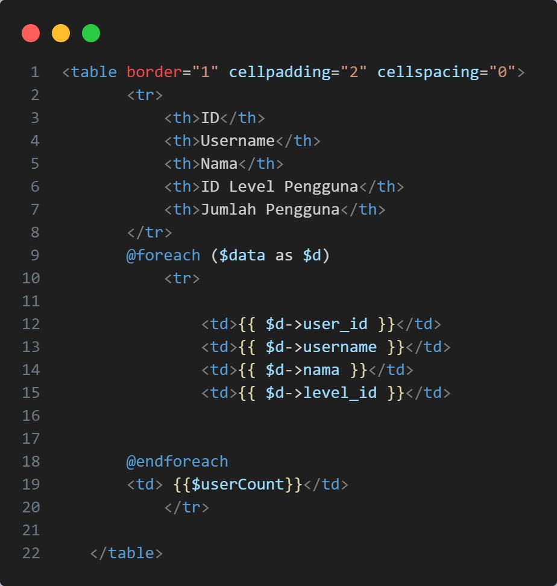
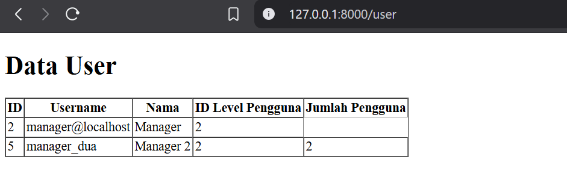

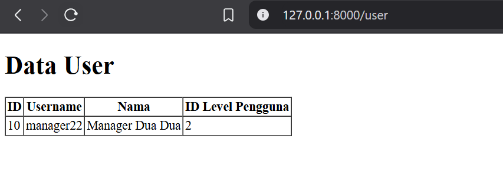

**Praktikum** **2.4** **–** **Retreiving** **or** **Creating**
**Models**

> 1\. Q: Simpan kode program Langkah 1 dan 2. Kemudian jalankan pada
> browser dan amati apa yang terjadi dan beri penjelasan dalam laporan

> A:
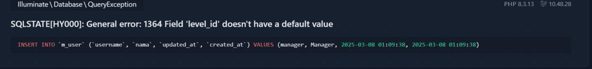
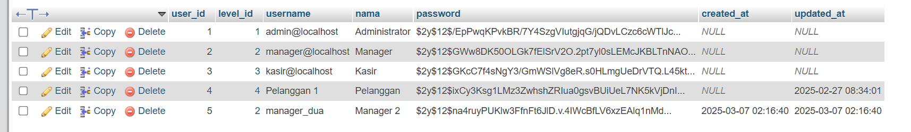Akan terjadi error karena
funsgi first tidak dapan mencari username manager dan nama Manager

Karena tidak ketemu fungsi tersebut akan menjalankan fungsi create,
namun karena attribute level id tidak ada value maka akan terjadi error.

> 2\. Q: Simpan kode program Langkah 4. Kemudian jalankan pada browser
> dan amati apa yang terjadi dan cek juga pada phpMyAdmin pada tabel
> m_user serta beri penjelasan dalam laporan
>
> A:
>
 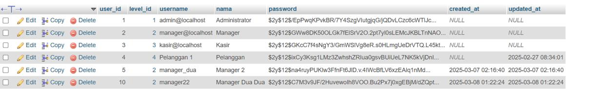Dan akan membuat record
> baru dalam database

> 3\. Q: Simpan kode program Langkah 6. Kemudian jalankan pada browser
> dan amati apa yang terjadi dan beri penjelasan dalam laporan

> A: Tetap akan error seperti percobaan 1, namun jika kita tambahkan
> kode yang mendefiniskan user_level, maka tampilan akan menjadi serti
> ini
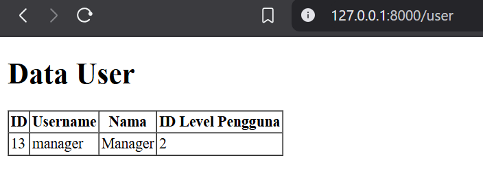
> 4\. Q: Simpan kode program Langkah 8. Kemudian jalankan pada browser
> dan amati apa yang terjadi dan cek juga pada phpMyAdmin pada tabel
> m_user serta beri penjelasan dalam laporan
>
> A:
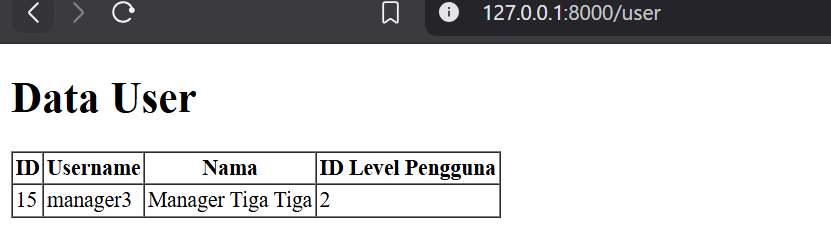
> 5\. Q: Simpan kode program Langkah 9. Kemudian jalankan pada browser
> dan amati apa yang terjadi dan cek juga pada phpMyAdmin pada tabel
> m_user serta beri penjelasan dalam laporan
>
>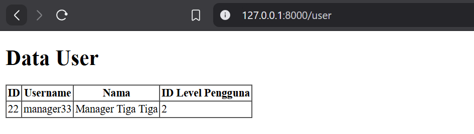A: Akan menyimpan haris
> kode pada Use

**Praktikum** **2.5** **–** **Attribute** **Changes**

> 1\. Q: Simpan kode program Langkah 1. Kemudian jalankan pada browser
> dan amati apa yang terjadi dan beri penjelasan dalam laporan
>
> A:
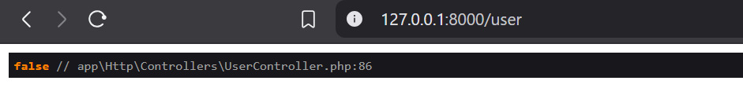
> Ini berarti attributenya belum ada yang terganti.
>
> 2\. Q: Simpan kode program Langkah 3. Kemudian jalankan pada browser
> dan amati apa yang terjadi dan beri penjelasan dalam laporan
>
> A: 
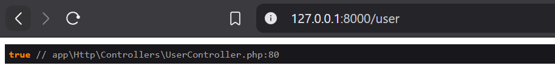
>
> Hasil tersebut menandakan bahwa data telah pernah diubah.

**Praktikum** **2.6** **–** **Create,** **Read,** **Update,** **Delete**
**(CRUD)**

> 1\. Q: Simpan kode program Langkah 1 dan 2. Kemudian jalankan pada
> browser dan amati apa yang terjadi dan beri penjelasan dalam laporan
>
> 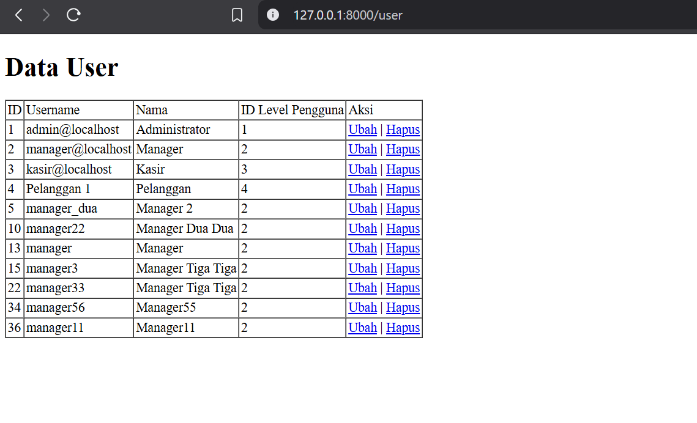 style="width:5.46458in;height:3.32014in" />A: Akan berisikan table
> crud yang berisikan m_user

> 2,. Q: Simpan kode program Langkah 4 s/d 6. Kemudian jalankan pada
> browser dan klik link “+ Tambah User” amati apa yang terjadi dan beri
> penjelasan dalam laporan
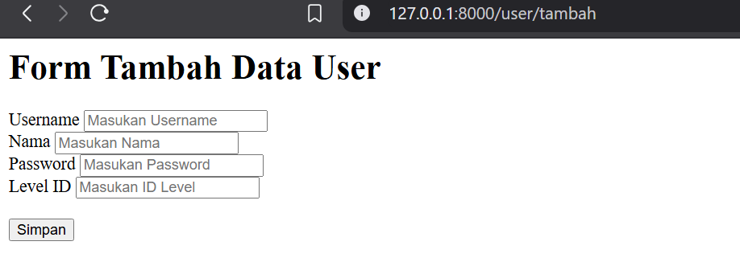
> A: Akan muncul halaman untuk mengcreate data baru untuk m_user
>
> 2\. Q: Simpan kode program Langkah 8 dan 9. Kemudian jalankan link
> localhost:8000/user/tambah atau localhost/PWL_POS/public/user/tambah
> pada browser dan input formnya dan simpan, kemudian amati apa yang
> terjadi dan beri penjelasan dalam laporan
>
> 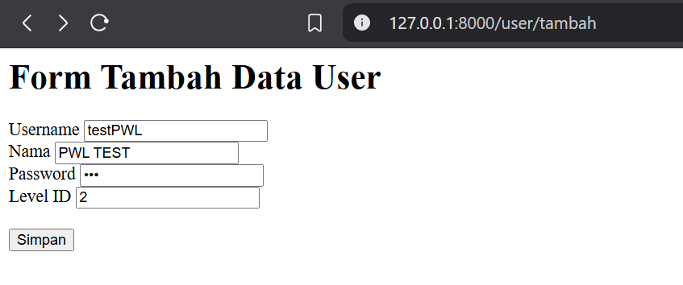 style="width:5.37569in;height:2.24653in" />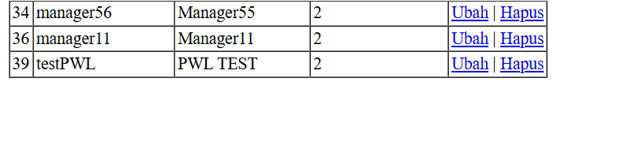 style="width:6.26805in;height:1.43472in" />A: Akan maka jika isisan
> disi dan tombol simpan diklik, maka akan menambahkan record baru

> 3\. Q: Simpan kode program Langkah 11 sd 13. Kemudian jalankan pada
> browser dan klik link “Ubah” amati apa yang terjadi dan beri
> penjelasan dalam laporan
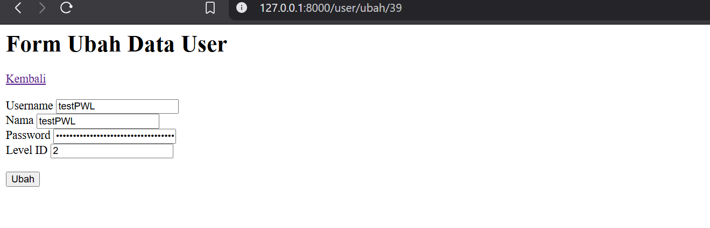
> A: Halaman akan berubah menjadi halaman edit yang di mana value
> isiannya akan sama dengan value yang kita pencet edit
>
> 4\. Q: Simpan kode program Langkah 15 dan 16. Kemudian jalankan link
> localhost:8000/user/ubah/1 atau localhost/PWL_POS/public/user/ubah/1
> pada browser dan ubah input formnya dan klik tombol ubah, kemudian
> amati apa yang terjadi dan beri penjelasan dalam laporan
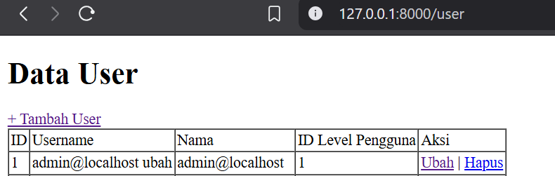
> A: Akan mengubah value attribute untuk user_id 1 yaitu admin
>
> 5\. Q: Simpan kode program Langkah 18 dan 19. Kemudian jalankan pada
> browser dan klik tombol hapus, kemudian amati apa yang terjadi dan
> beri penjelasan dalam laporan
>
> A: kode tersebut akan berjalan ketika tombol hapus diklik, ketika
> diklik maka akan menghapus bari yang dipencet

**Praktikum** **2.7** **–** **Relationships**

> 1\. Q: Simpan kode program Langkah 2. Kemudian jalankan link pada
> browser, kemudian amati apa yang terjadi dan beri penjelasan dalam
> laporan
>
> A:
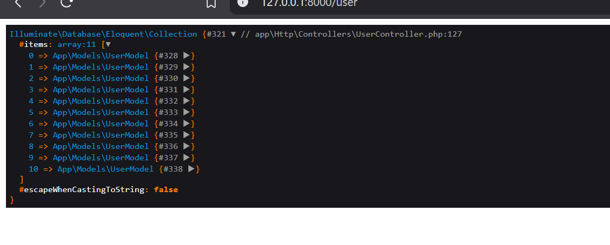
> Kode akan mengambil semua user yang mempunyai level.
>
> 2\. Q: Simpan kode program Langkah 4 dan 5. Kemudian jalankan link
> pada browser, kemudian amati apa yang terjadi dan beri penjelasan
> dalam laporan
>
> 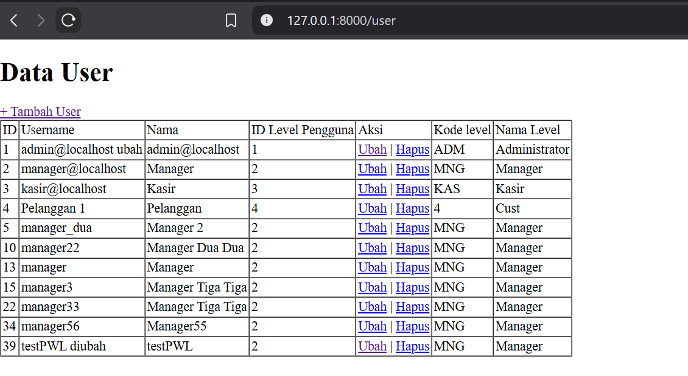 style="width:6.26805in;height:3.43333in" />A: Akan menampilkan value
> dari kode level dan nama level
