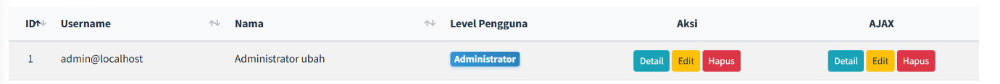
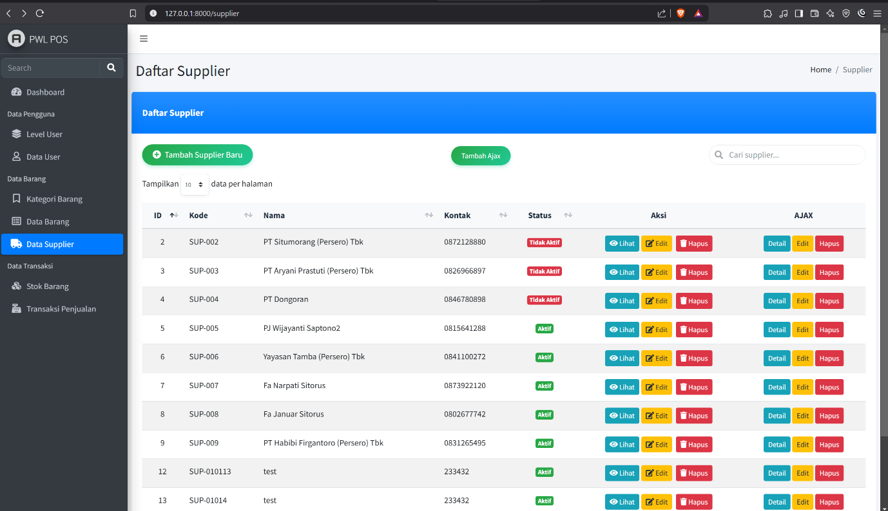

 ## Laporan Pemrogaman WEB Lanjut Jobsheet 6 Ajax Form (AdminLTE) dan Client Validation

## Politeknik Negeri Malang 
## Semester 4
 ## 2025
>
> **NIM** 2341720082
>
> **Nama** Noklent Fardian Erix
>
> **Kelas** 2A
>
> **Jurusan** Teknologi Informasi
>
> **Progam** **Studi**
>
> D-IV Teknik Informatika

**Praktikum** **1.** **Modal** **Ajax** **Tambah** **Data** **(Data**
**User)**

> 1\. Q: OK, sekarang kita coba melakukan proses tambah data user
> menggunakan form ajax. Amati apa yang terjadi dan laporankan pada
> laporan jobsheet dan commit di github kalian!!!
>
>  style="width:4.63333in;height:2.64722in" /> style="width:6.26805in;height:0.38542in" />A: Codingan pada praktikum
> 1 akan membuat halman create yang menggunakan modal, jadi kita tidak
> perlu untuk mengganti Alamat untuk ingin menambahkan data.

**Praktikum** **2.** **Modal** **Ajax** **Edit** **Data** **(Data**
**User)**

> 1\. Q: Sekarang kita coba bagian edit user, amati proses nya. Jangan
> lupa laporkan dan commit ke repository git kalian !
>
>  style="width:6.26805in;height:3.60208in" /> style="width:6.26805in;height:0.53194in" />A: Codingan pada praktikum
> 2 akan membuat halman create yang menggunakan modal, jadi kita tidak
> perlu untuk mengganti Alamat untuk ingin merubah data.

**Praktikum** **3.** **Modal** **Ajax** **Hapus** **Data** **(Data**
**User)**

> 1\. Q: Setelah semua selesai, mari kita coba untuk melakukan percobaan
> dari koding yang telah kita lakukan.
>
>  style="width:6.26805in;height:3.30694in" />A: Akan menampilkan rincian
> record mana yang akan kita hapus dalam bentuk modal

**Tugas**

>**1.** **Barang** **Table**

>  style="width:6.26805in;height:3.1375in" /> style="width:6.26805in;height:3.69861in" />

**2.** **Level** **Table**
>  style="width:6.26805in;height:3.3618in" /> style="width:6.26805in;height:2.67847in" />

**3.** **Kategori**
>  style="width:6.26805in;height:3.50486in" /> style="width:6.26805in;height:2.90625in" />

**4.** **Tabel**
> **m_supplier**
>  style="width:6.26805in;height:3.45486in" /> style="width:6.26805in;height:3.6125in" />

